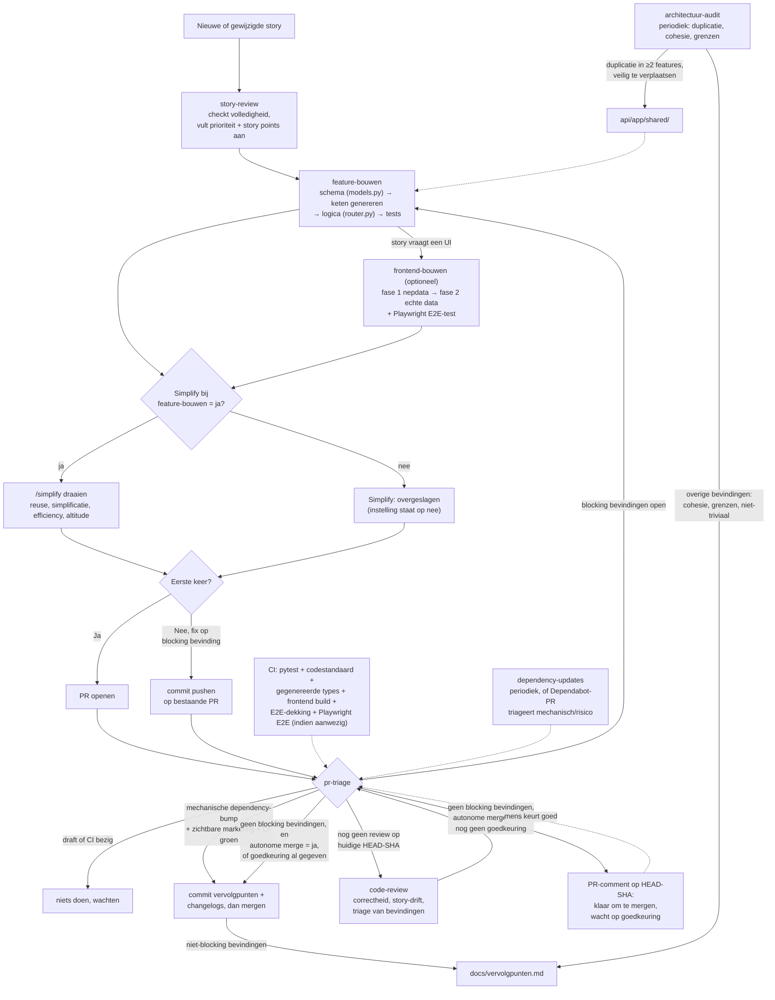

# CLAUDE.md — Contract-first werkwijze

> **Gericht op multi-service applicaties** — meerdere onafhankelijk deploybare services
> (ADR-0002), een Next.js BFF, LLM-orkestratie en async achtergrondtaken.

## Wat dit is

Methodologie voor feature-ontwikkeling in een project met een database, een API en een
frontend: **contract-first + vertical slicing**. Vorm (velden, types) wordt op één plek
vastgelegd en gegenereerd naar de rest; gedrag (businessregels) wordt apart, met de hand
geschreven.

De werkwijze bestaat uit losse **skills** onder `.claude/skills/`, elk met een eigen trigger
en regel-checklist. Dit bestand is de index — de skills zelf zijn het uitvoerbare document.

De concrete uitwerking van "de ene bron" en de rest van wat een skill anders zou aannemen is
per project vastgelegd in `docs/architectuur/stack-profiel.md` (zie ADR-0004) — de werkwijze
zelf is niet aan één stack gebonden, ook al is `feature-bouwen` regel 3 vooralsnog de enige
regel die dat consequent volgt. De werkende referentie-implementatie staat in `../voorbeeld/wetsanalyse/` (multi-service:
Next.js BFF, LLM-orkestratie, async jobs). Zie de CLAUDE.md in die submap voor toelichting
op de features en de relatie tot de werkwijze.

## Verificatie-principe

Een regel die alleen als tekst in een skill staat, is geen garantie dat hij ook gebeurt — een
stap die geen eigen, zichtbaar spoor achterlaat (tests-groen, generatieketen-actueel, een
`/simplify`-uitkomst, isolatie) kan zonder dat iemand het merkt overgeslagen worden zodra de
rest van het werk al "klaar" aanvoelt.

Daarom, voor elke skill: een stap is pas een echte controle als één van deze waar is —
1. **Een automatische, onafhankelijke check bevestigt het** (bv. CI in
   `.github/workflows/ci.yml`, die tests-groen en generatieketen-actueel al afdwingt zonder op
   zelfrapportage te vertrouwen), of
2. **Een andere skill kan het objectief nakijken** — tegen de diff zelf (bv. `code-review`
   regel 1, die `feature-bouwen`'s regels stuk voor stuk tegen de code aanhoudt), of, als de
   diff het niet laat zien, via een verplichte regel in het commit-/PR-bericht die die andere
   skill controleert (bv. de "Simplify:"-regel, zie `feature-bouwen` regel 9).

Een stap zonder een van beide is geen vangrail, alleen een goede bedoeling. Belangrijke
kanttekening: been 2 in z'n berichtvorm bewijst dat er een regel getypt is, niet dat de
onderliggende actie daadwerkelijk is uitgevoerd — dat is zwakker dan been 1, en geaccepteerd
als de pragmatische ondergrens voor stappen die zich niet automatisch laten verifiëren. Kom je
een gat tegen: voeg een CI-check toe als het deterministisch te verifiëren is, anders een
verplichte regel + een expliciete check in de skill die erna komt.

## Instellingen

- **Autonome merge:** nee <!-- ja | nee -->
  `nee` — `pr-triage` mergt niet zelf; zodra `code-review` niets blocking meer vindt, zet het
  een PR-comment ("klaar om te mergen, wacht op goedkeuring") en wacht op een menselijke
  approve (zie `.claude/skills/pr-triage/SKILL.md` regel 2b). Dit is de enige plek waar dat
  wordt aangegeven — verander het hier, niet in de skill zelf.

- **Simplify bij feature-bouwen:** ja <!-- ja | nee -->
  `ja` — `feature-bouwen` regel 9 draait `/simplify` (vier parallelle subagents) vóór elke
  aflevering. Zet op `nee` om dit uit te zetten (bv. om tokens te besparen bij veel kleine
  wijzigingen) — regel 9 zet dan zelf `Simplify: overgeslagen (instelling staat op nee)` in het
  commit-/PR-bericht in plaats van de check te draaien, zodat het uitzetten zelf zichtbaar en
  controleerbaar blijft.

## Codestandaard

Vorm van de code zelf (opmaak, imports, ongebruikte variabelen) is een geautomatiseerde check,
geen proza-richtlijn — een geschreven stijlgids die niemand afdwingt is hetzelfde
"geen vangrail"-probleem als elders in dit document (§Verificatie-principe).

- **Python:** `ruff` (zie `stack-profiel.md` §Codestandaard voor de exacte config) — lint en format-check.
- **TypeScript:** `eslint` + `prettier` — `npm run lint` en `npm run format:check`.

Beide draaien in CI — dat is been 1 van het Verificatie-principe, dus geen aparte
checklist-regel nodig in `feature-bouwen` of `code-review`. Draai de formatters lokaal vóór je
aflevert om een CI-fail puur op opmaak te voorkomen; dat is gemak, geen verplichte stap.

## Skills

| Skill | Trigger |
|---|---|
| [`story-review`](.claude/skills/story-review/SKILL.md) | Nieuwe of gewijzigde story, vóór er gebouwd wordt. |
| [`feature-bouwen`](.claude/skills/feature-bouwen/SKILL.md) | Nieuwe user story, of uitbreiding van bestaand gedrag. |
| [`frontend-bouwen`](.claude/skills/frontend-bouwen/SKILL.md) | **Optioneel** — alleen als de story een UI/scherm vraagt, ná `feature-bouwen` regel 1-6. |
| [`pr-triage`](.claude/skills/pr-triage/SKILL.md) | PR aangemaakt of bijgewerkt — bepaalt of review, verwerken van bevindingen, mergen of niets de volgende stap is. |
| [`code-review`](.claude/skills/code-review/SKILL.md) | `pr-triage` concludeert dat de PR nog geen review op de huidige stand heeft gehad. |
| [`architectuur-audit`](.claude/skills/architectuur-audit/SKILL.md) | Vaste cadans (bv. wekelijks), los van een specifieke feature of PR. |
| [`dependency-updates`](.claude/skills/dependency-updates/SKILL.md) | Vaste cadans (bv. wekelijks), of een open Dependabot-PR. |

Zie elke skill voor de volledige regels, bekende valkuilen en wat de werkwijze niet oplost. De
flowchart hieronder toont de onderlinge volgorde in één oogopslag.

## Flowchart




## Documentatiestructuur

- `docs/architectuur/` — twee soorten inhoud:
  - `c4-model.md` — Context/Container/Component/Code (C4-model); zie de §Bijhouden-sectie
    daar voor wanneer elk niveau bijgewerkt moet worden.
  - `adr/NNNN-<naam>.md` — ADR's: projectbrede technische beslissingen (niet feature-specifiek,
    dat is `docs/stories/`): welke stack, welke afwezigheden (auth, migraties, microservices)
    en waarom. Eén genummerd bestand per beslissing, kopieer `docs/architectuur/adr/TEMPLATE.md`.
    Een gemaakte, beargumenteerde keuze — geen open punt (dat is `docs/vervolgpunten.md`).
  - `stack-profiel.md` — het projectspecifieke antwoord op de vragen die `feature-bouwen` regel 3
    (en, naarmate meer regels gegeneraliseerd worden, mogelijk andere skills) niet meer
    hardcodeert: de ene bron, contractgeneratie, feature-eenheid, dunne verzamelaars, topologie,
    migraties, frontend(s). Kopieer `docs/architectuur/stack-profiel.TEMPLATE.md`; vereist vóór
    `feature-bouwen` regel 3 bruikbaar is (zie ADR-0004).
- `docs/stories/TEMPLATE.md` — startpunt voor een nieuwe story (prioriteit `none`, story points nog
  leeg); kopiëren en hernummeren, niet direct bewerken.
- `docs/stories/` — user stories + schemabeslissing, inclusief terugverwijzingen naar gedeelde
  modules en de door `story-review` aangevulde prioriteit + story points. Eén document per
  feature, genummerd.
- `docs/vervolgpunten.md` — niet-blocking bevindingen die `pr-triage` (bij het mergen) of
  `architectuur-audit` (direct, ook een dagregel dat de audit gedraaid heeft) hier neerzetten.
- `CHANGELOG.md` — gebruikersgericht, één regel per feature; bugfixes/kleine verbeteringen
  verzameld, pure technische wijzigingen ontbreken. Bijgehouden door `pr-triage`.
- `docs/changelog-technisch.md` — voor AI/team/developers, één regel per gemergde PR zonder
  uitzondering. Bijgehouden door `pr-triage`.
- `api/app/features/<naam>/` — alles voor die feature: `models.py`, `router.py`, `tests/`.
- `api/app/shared/` — modules die door de architectuur-audit (of opportunistisch tijdens
  featurebouw) uit ≥2 features zijn geëxtraheerd.
- `frontend/generated/` — nooit met de hand bewerken, altijd via `scripts/genereer-types.sh`.
- `frontend/tests/e2e/` — Playwright-E2E-tests, één per UI-feature (`frontend-bouwen` regel 6);
  de aanwezigheid ervan wordt in CI gecontroleerd (`check-frontend-e2e-coverage`), niet alleen
  het slagen van wat er al staat (`test-frontend-e2e`).

## Een nieuw project starten

Gebruik `../voorbeeld/wetsanalyse/` als startpunt en kopieer de inhoud naar een nieuwe repo.
`.github/` (CI, dependabot) staat mee in de submap, met paden zonder prefix — dat werkt
onveranderd zodra die submap de root van een eigen repo wordt, geen handmatige stap nodig.

Wijkt het nieuwe project qua stack af van het gekozen voorbeeld (geen SQLModel, geen
contractgeneratie, meerdere services, ...): vervang `docs/architectuur/stack-profiel.md` door
een eigen invulling (kopieer `docs/architectuur/stack-profiel.TEMPLATE.md` opnieuw) vóórdat je
`feature-bouwen` gebruikt — zie ADR-0004. Regel 3 is de enige regel die dit tot nu toe
consequent leest; de overige skills bevatten nog stack-specifieke aannames (zie ADR-0004
§Consequenties voor de precieze lijst) totdat ze in een latere ronde gegeneraliseerd worden.

**Kanttekening voor déze monorepo:** GitHub Actions en Dependabot lezen uitsluitend
`.github/` op de root van een repository, nooit uit een submap. Zolang `werkwijze/` en
`voorbeeld/wetsanalyse/` in dezelfde GitHub-repo zitten, draait er dus geen CI en scant
Dependabot niets — `voorbeeld/wetsanalyse/.github/` bestaat in de juiste vorm voor ná het
splitsen, maar wordt tot die tijd door GitHub genegeerd. Been 1 van het Verificatie-principe
staat daarmee tijdelijk stil voor deze repo zelf; dat is een bewuste, geaccepteerde keuze
totdat `voorbeeld/wetsanalyse/` als eigen repo bestaat, niet iets om nu nog op te lossen door
`.github/` (ook) op de root te dupliceren.

Kopieer daarna `.claude/skills/` naar de root van je workspace (de map die alle repos bevat),
zodat de skills beschikbaar zijn vanuit elke submap:

```
workspace/
  .claude/
    skills/          ← hierheen kopiëren
  werkwijze-repo/    ← deze repo (werkwijze + voorbeeld/wetsanalyse)
  mijn-project/      ← nieuwe repo, gestart vanuit een van de voorbeelden
```

De skills verwijzen naar `api/`, `frontend/`, `docs/` zonder prefix — dat zijn de paden zoals
ze in een nieuw project heten (de project-root is de repo-root). In déze repo zitten ze onder
`voorbeeld/wetsanalyse/`; zie de CLAUDE.md in die submap voor toelichting.
